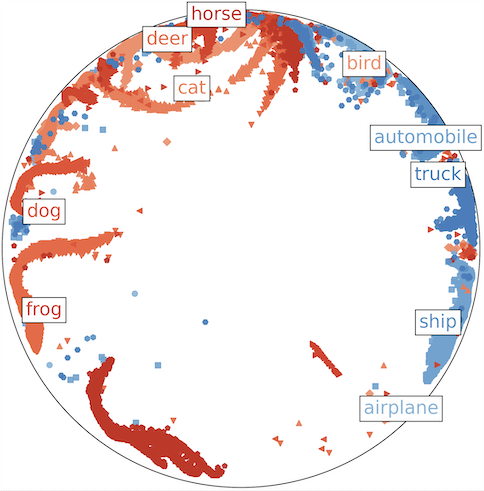
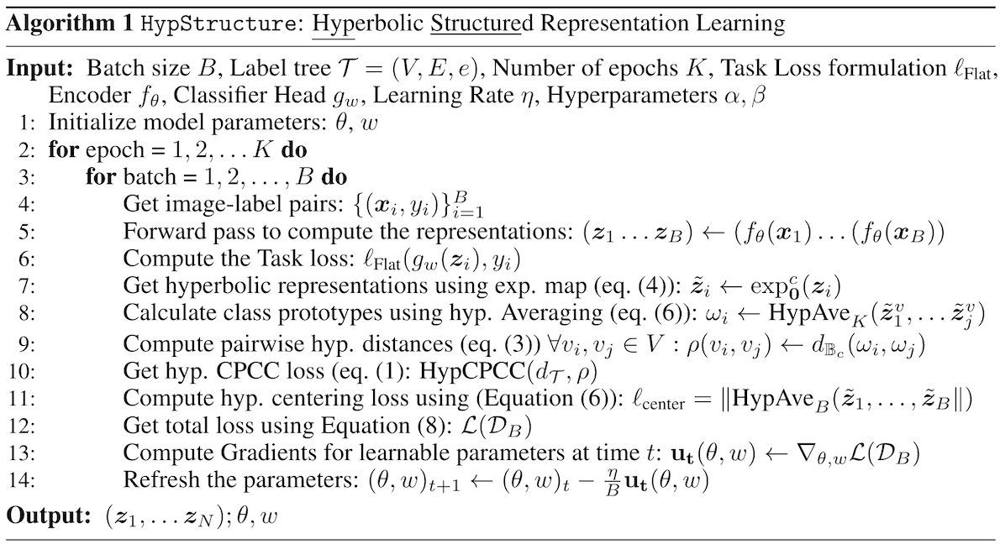

# [NeurIPS'24] HypStructure
[Paper](https://arxiv.org/pdf/2412.01023) | [NeurIPS Virtual (Video)](https://neurips.cc/virtual/2024/poster/93170) | [Poster](https://neurips.cc/media/PosterPDFs/NeurIPS%202024/93170.png?t=1731743482.698525) | [Slides](https://neurips.cc/media/neurips-2024/Slides/93170.pdf) | [Code](https://github.com/uiuctml/HypStructure) 

This is the official repository for HypStructure: Hyperbolic Structured regularization proposed in our NeurIPS 2024 paper [Learning Structured Representations with Hyperbolic Embeddings](https://arxiv.org/pdf/2412.01023).

---
## Abstract
Most real-world datasets consist of a natural hierarchy between classes or an inherent label structure that is either already available or can be constructed cheaply. However, most existing representation learning methods ignore this hierarchy, treating labels as permutation invariant. Recent work [Zeng et al., 2023](https://openreview.net/pdf?id=7J-30ilaUZM) proposes using this structured information explicitly, but the use of Euclidean distance may distort the underlying semantic context [Chen et al., 2013](https://arxiv.org/pdf/1201.1717). In this work, motivated by the advantage of hyperbolic spaces in modeling hierarchical relationships, we propose a novel approach HypStructure: a Hyperbolic Structured regularization approach to accurately embed the label hierarchy into the learned representations. HypStructure is a simple-yet-effective regularizer that consists of a hyperbolic tree-based representation loss along with a centering loss, and can be combined with any standard task loss to learn hierarchy-informed features. Extensive experiments on several large-scale vision benchmarks demonstrate the efficacy of HypStructure in reducing distortion and boosting generalization performance especially under low dimensional scenarios. For a better understanding of structured representation, we perform eigenvalue analysis that links the representation geometry to improved Out-of-Distribution (OOD) detection performance seen empirically. 

---
## Motivation

This work extends the work of [Zeng et al., 2023](https://github.com/uiuctml/HierarchyCPCC) for structured regularization in the hyperbolic space. 

Visualization of the learnt representation for the CIFAR-10 dataset in the hyperbolic space.



This repository implements the following algorithm in `main.py` and `loss.py`. 



---

## Setup
- To download the repository and install all necessary requirements, clone the repository followed by installation of the required dependencies using conda: 
```
git clone https://github.com/uiuctml/HypStructure
conda env create -n hierarchy --file environment.yml
```

## Datasets

We use the CIFAR10, CIFAR100 and IMAGENET100 datasets as In-Distribution (ID) datasets and SVHN, Textures, Places365, LSUN, iSUN datasets as the Out-of-Distribution (OOD) datasets for CIFAR10/100 and SUN, Places, Textures and iNaturalist as the OOD datasets for IMAGENET100 respectively. The ID datasets are constructed in `data/` whereas the OOD datasets have to be downloaded and placed in the respective `ood_datasets/<dataset_name>/` folder. 

- ID Datasets: Following the setup in [Zeng et al., 2023](https://github.com/uiuctml/HierarchyCPCC), we use the datasets from `torchvision.datasets` along with the hierarchies defined in the files `<ID_dataset_name>/class_hierarchy.txt`. For IMAGENET100, we construct the subset dataset using the 100 class names defined in prior work [MCM](https://github.com/deeplearning-wisc/MCM/blob/main/data/ImageNet100/class_list.txt). 

- OOD Datasets: Following the dataset source and pre-processing setup from [CIDER](https://github.com/deeplearning-wisc/cider), the datasets are from: 
    - SVHN
    - Textures
    - Places365
    - LSUN
    - iSUN
    - iNaturalist
    - SUN
    - Places 
    - Textures

    The OOD datasets for IMAGENET100 as the ID dataset are curated and de-duplicated with the IMAGENET-1k dataset, created by [Huang et al., 2021](https://github.com/deeplearning-wisc/large_scale_ood)


## Training and Evaluation
The primary training code is specified in `main.py` which can be run with the followed command 
```
CUDA_VISIBLE_DEVICES=0 python main.py --timestamp <model_name> --num_workers 1 <additional-training-args>
```

There are several arguments that can be used to specify the experimental setup and the hyperparameters, we describe a few while some are self-explanatory: 


- `--timestamp`: a unique id to identify your experiment. You can use `datetime.now().strftime("%m%d%Y%H%M%S")` if you want to timestamp as the identifier.

- `--dataset`: specify the In-Distribution (ID) datasets for the experimetn from `CIFAR10`, `CIFAR100`, or `IMAGENET100`. Out-of-distribution evalution is run for the corresponding OOD datasets automatically.

- `--exp_name`: loss functions, the code currently supports two functions
    - `ERM`: empirical risk minimization
    - `SupCon`: Supervised Contrastive Loss (SupCon) [[Khosla et al. 2021](https://arxiv.org/pdf/2004.11362)] adapted from the original [SupCon implementation](https://github.com/google-research/google-research/tree/master/supcon).

- `--model_name`: specify the backbone model architecture, for e.g. `resnet34`

- `--cpcc`: 0 to use a loss function without any CPCC based regularization, 1 to use loss functions with CPCC based regularization. 

- `--cpcc_metric`: metric on feature space. Available choices include `l2`, `l1`, `poincare` , `poincare_exp` and `poincare_mean`, where `poincare_exp` refers to the euclidean-averaging algorithmic variant followed by hyperbolic mapping [(See Section 3.2)](https://arxiv.org/pdf/2412.01023) whereas `poincare_mean` refers to the hyperbolic averaging algorithmic variant. We empirically observe that the `poincare_mean` variant performs better for the ID-classification, whereas the `poincare_exp` variant demonstrates better OOD detection performance. 


- `--center`: setting this to `1` uses the centering loss defined in the paper, wheras setting it to `0` disables the centering loss.

- `--lamb`: regularization factor of the CPCC based regularizer. Default value is 1. 

All default training hyperparameters are saved in json files under corresponding dataset folders in `hyperparameters.json`. 

Commands to run experiments for each dataset: 

CIFAR10: 
```
CUDA_VISIBLE_DEVICES=0 python main.py --timestamp hypstructure_cifar10 --num_workers 1 --dataset CIFAR10 --exp_name SupCon --model_name resnet18 --cpcc 1 --seeds 1 --cpcc_metric poincare_mean --save_freq 20 --feature_dim 512 --center 1
```


CIFAR100: 
```
CUDA_VISIBLE_DEVICES=0 python main.py --timestamp hypstructure_cifar100 --num_workers 1 --dataset CIFAR100 --exp_name SupCon --model_name resnet34 --cpcc 1 --seeds 1 --cpcc_metric poincare_mean --save_freq 20 --feature_dim 512 --center 1
```


IMAGENET100: 
```
CUDA_VISIBLE_DEVICES=0 python main.py --timestamp hypstructure_imagenet100 --num_workers 4 --dataset IMAGENET100 --exp_name SupCon --model_name resnet34 --cpcc 1 --seeds 1 --cpcc_metric poincare_mean --save_freq 5 --feature_dim 512 --center 1 --lamb 0.1
```

To evaluate the saved models, use the evaluation script as: 

```
python evaluate.py --dataset <id_dataset_name> --model_save_location /path/to/model_save_location
```


## Acknowledgement
Our work is built upon several code repositories, namely [HierarchyCPCC](https://github.com/uiuctml/HierarchyCPCC), [Hyperbolic Image Embeddings](https://github.com/leymir/hyperbolic-image-embeddings) and [Hyperbolic Vision Transformers](https://github.com/htdt/hyp_metric) for implementation of training functions, and [CIDER](https://github.com/deeplearning-wisc/cider) and it's attributed sources for setup and processing of the OOD datasets. 

## Citation
If you find our work helpful, please consider citing our paper:

```
@inproceedings{
sinha2024learning,
title={Learning Structured Representations with Hyperbolic Embeddings},
author={Aditya Sinha and Siqi Zeng and Makoto Yamada and Han Zhao},
booktitle={Neural Information Processing Systems},
year={2024},
url={https://arxiv.org/pdf/2412.01023}
}
```

## Contact
Please contact as146@illinois.edu for any questions or comments.
